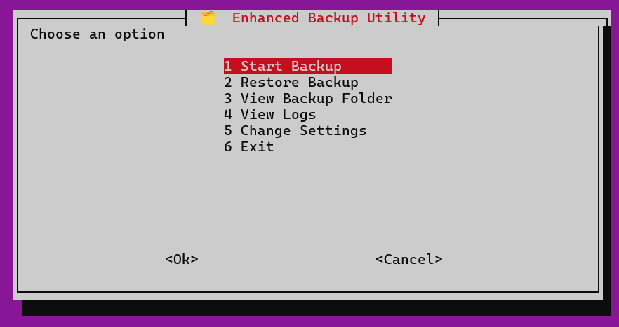

# Backup Utility with Terminal UI

A simple terminal-based **backup tool** for Linux/WSL/Git Bash.  
It allows you to **back up directories**, **view backups**, and **check logs** easily.

---

## Features
- Backup any folder with automatic timestamped naming.  
- View your backup folder from the menu.  
- View logs of all backups.  
- Uses `rsync` for reliable copying.  
- Terminal menu interface using `whiptail`.  

---

## Installation
1. Go to the project folder where the script is saved.  
2. Make the script executable:  
```bash
chmod +x backup_utility.sh
````

3. Install dependencies (if missing):

```bash
sudo apt install whiptail rsync
```

---

## Usage

Run the script:

```bash
./backup_utility.sh
```

**Menu options:**

1. **Start Backup** – Enter the full path of the folder to back up.
2. **View Backup Folder** – Open the backup directory.
3. **View Logs** – See details of all backup operations.
4. **Exit** – Close the utility.

---

## Backup & Log Locations

* **Backups:** `~/backup/`
* **Logs:** `~/.backup_logs/`

---

## Requirements

* Linux / WSL / macOS
* `bash`
* `whiptail`
* `rsync`

---

## Screenshots 

**Backup Menu**


**Backup Process**


---

